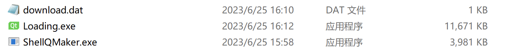
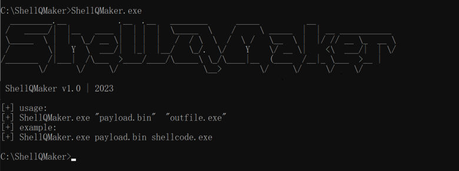
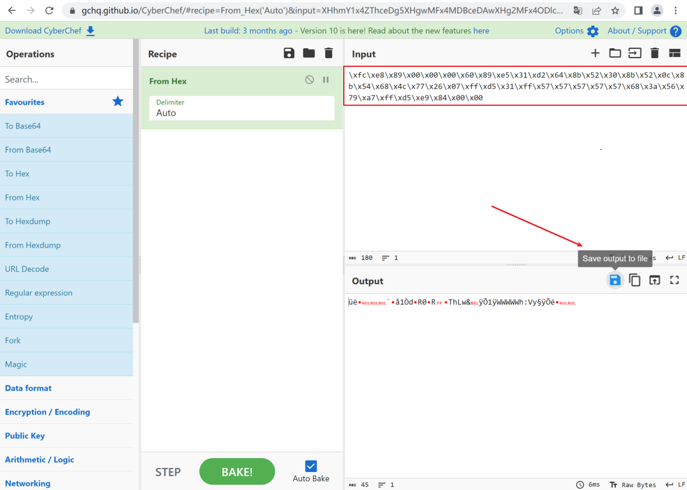
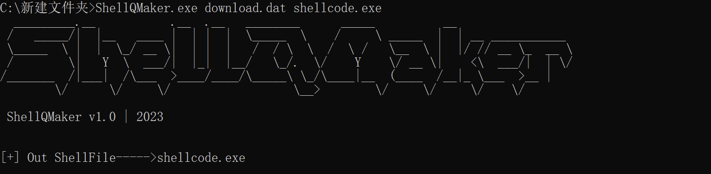
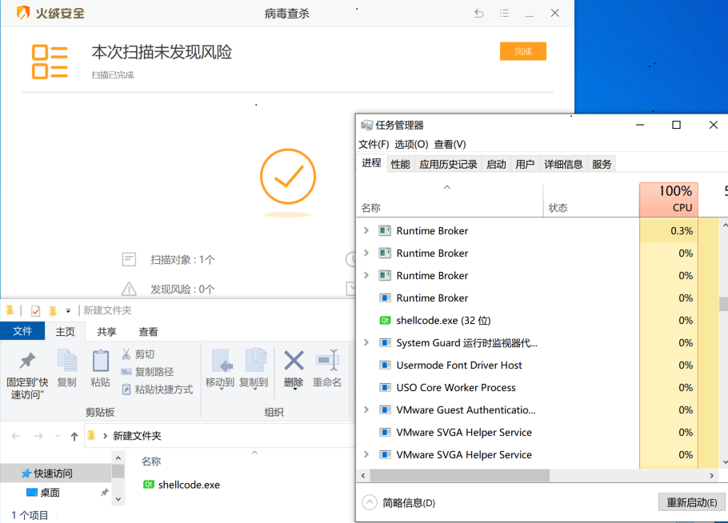
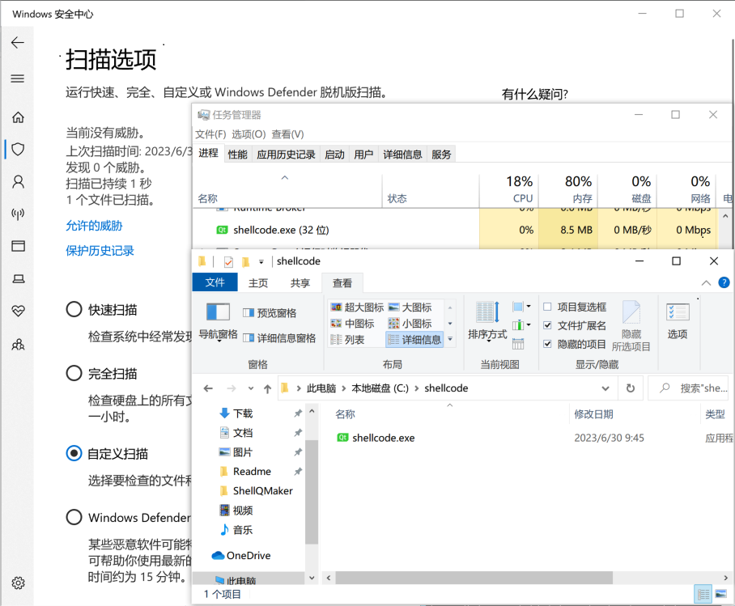
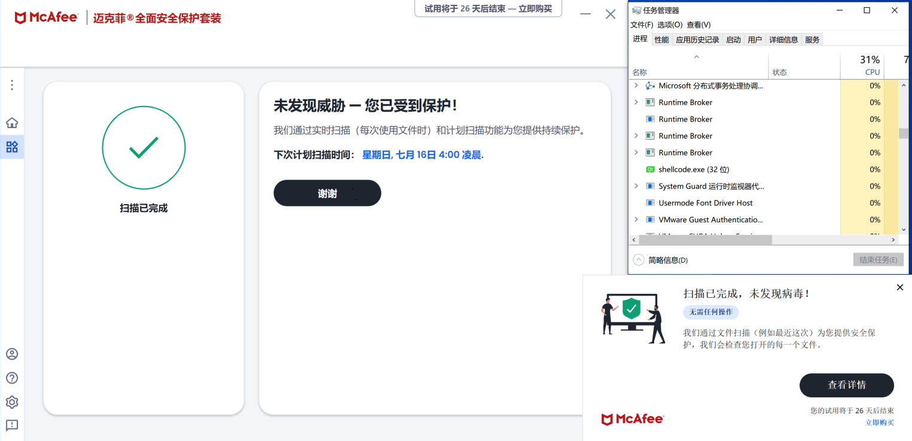

# ShellcodeLoader
Windows通用免杀shellcode加载器

language: [English](readme_en.md)

Windows平台的ShellcodeLoader能够免杀Microsoft Defender、360、火绒、迈克菲、Panda.

## 功能特点

环境：加载器模板使用QT实现，生成器和加载器模板使用C++开发，并由VS2022静态编译。

目前只有一种加载模式，其他加载模式正在开发中。

截至发布时间，该项目免杀国内外主流杀毒软件；
 
方法：使用vs2022打开项目解决方案（.sln），然后进行编译即可。当然，你也可以从[realse](https://github.com/SecurityAnalysts01/ShellcodeLoader/releases/download/v1.0/ShellQMaker1.1.zip)下载项目。
 
## Project Files

本工具由生成器（ShellQMaker.exe）和加载模板文件（loading.exe）组成。生成器（ShellQMaker.exe）将不同的shellcode写入加载的模板文件（loading.exe）中，生成不同的可执行文件。

## 使用方法

**执行ShellQMaker查看帮助**

**获取payload.bin文件**

**ShellQMaker (你的shellcode) (生成的可执行文件)**

**最终生成的可执行免杀程序**

## Result
360

火绒

Microsoft Defender

迈克菲

